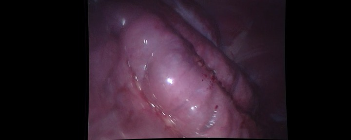
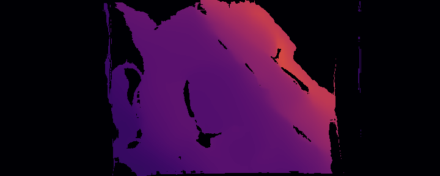
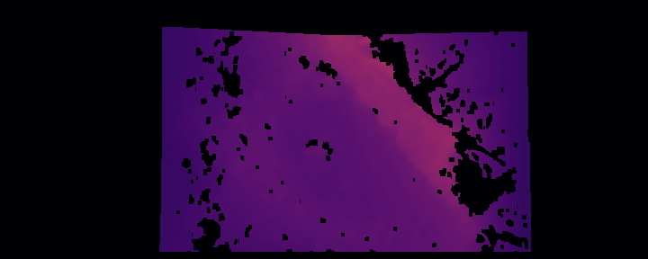

# hamlyn_depth_dataset_v2
Pseudo Ground-Truth (GT) depth generation using optical flow or stereo depth estimation models.

This repository provides tools to generate pseudo depth maps for the rectified Hamlyn Dataset using Optical flow models (e.g., RAFT).

The generated pseudo depth can be used as an alternative supervisory signal.

This project is based on the rectified Hamlyn dataset available in the [Endo-Depth-and-Motion repository](https://github.com/UZ-SLAMLab/Endo-Depth-and-Motion):

## Ecample Results

A visual comparison between the input image, the generated pseudo depth, and the ground-truth depth is shown below:

<table>
  <tr>
    <td align="center">
      <br>
      Img
    </td>
    <td align="center">
      <br>
      Raft Psudo Depth
    </td>
    <td align="center">
      <br>
      GT Depth
    </td>
  </tr>
</table>
The disparity map is estimated using the RAFT optical flow model. Since the images are rectified, only the horizontal component of the optical flow is used to compute disparity and derive depth.


## Dataset

Download the rectified Hamlyn dataset [Here](https://github.com/UZ-SLAMLab/Endo-Depth-and-Motion)


## Calibration Files

Important Note for `rectified01`:

The calibration parameters provided for the `rectified01` sequence appear to correspond to half of the image resolution, resulting in incorrect depth scaling when used directly with the rectified images.

Since `rectified01` and `rectified06` were captured using the same stereo camera setup, this repository uses the calibration parameters from `rectified06` when processing `rectified01`.

## Installation

Clone the repository and install the project dependencies:

```bash
uv sync
```

Install PyTorch :

CPU:
```bash
uv pip install torch torchvision --index-url https://download.pytorch.org/whl/cpu
```

GPU(CUDA 11.8):
```bash
uv pip install torch torchvision --index-url https://download.pytorch.org/whl/cu118
```

## Usage

Run pseudo depth generation with:

```bash
uv run generate_psudo_gt.py \ 
    --data-folder path/to/dataset \ 
    --calibration-folder path/to/calibration \ 
    --visualization
```
During processing, the script automatically creates two output directories for each sequence:

- `depth_pseudo` — stores the generated pseudo-depth maps as NumPy (`.npy`) files as `float32` in `mm`.
- `depth_mask` — stores the corresponding validity masks as NumPy (`.npy`) files as `uint8`.

These files can be loaded directly using `numpy.load()` for training, evaluation, or visualization.

## Arguments

| Argument               | Description                                                                       |
| ---------------------- | --------------------------------------------------------------------------------- |
| `--data-folder`        | Path to the rectified Hamlyn dataset sequence.                                    |
| `--calibration-folder` | Path to the camera calibration files.                                             |
| `--visualization`      | Enable visualization of the generated disparity and depth maps during processing. |
